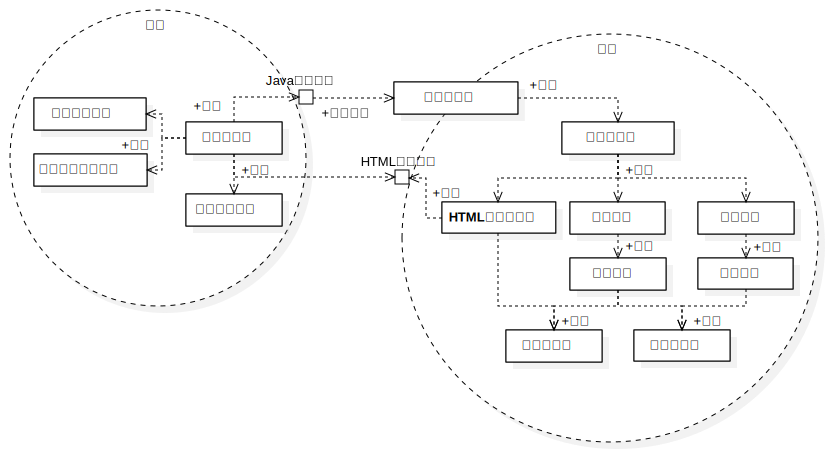

## WaterySQL 设计文档

<div align=center>计&nbsp;65&nbsp;&nbsp;&nbsp;&nbsp;郑少锟&nbsp;&nbsp;&nbsp;&nbsp;2016011381</div>


###### 一、概述

本项目实现了一个支持增删改查等基本操作的单线程单用户关系型数据库系统，且在基础功能之上实现了查询优化、多表连接、外键和主键约束、空值约束、唯一性约束、集合函数查询等扩展功能，并提供了命令行和图形界面的 SQL 语句查询入口。


###### 二、系统架构设计

系统主要包括前端交互的 GUI 和后端的解析执行和存储两大部分。总体架构图如下所示：

 

其中，前端界面包括用于展示数据库结构的文件树视图、用于输入 SQL 语句指令的命令编辑视图和用于显示命令执行结果的查询结果视图三大部分组成，并由视图控制器进行控制。视图控制器通过 JNI（Java Native Interface）调用后端模块，并在后端执行完成后读取生成的 HTML 表格文件用于更新界面视图。

后端由命令解析器解析通过 JNI 调用传入的命令字符串，生成具有相应的若干执行器。执行器调用系统管理模块和查询引擎相关接口执行命令，并通过 HTML 表格生成器生成包含相应执行结果的 HTML 文件。系统管理模块和查询引擎依赖于记录管理和索引管理模块完成相应功能。HTML 表格生成器、记录管理和索引管理模块则依赖于更底层的基础工具库和缓存页面管理模块。

整个系统的架构设计，使得前后端分离，各模块间层次结构清晰，方便修改和扩展。


###### 三、各模块详细设计

下面我将自顶向下地描述各模块的详细设计思路：

 1.  交互界面

     前端的交互界面使用 JAVA 和 Kotlin 语言，基于 Swing 库编写。设计时采用 MVC（Model-View-Controller）架构，即由通过 JNI 调用后端 C++ 接口的模型、包含若干交互控件的界面视图和控制这两者的视图控制器组成。实现的交互逻辑如下：

     - 用户在 `View` 中的命令编辑框 `editorPane` 中输入 SQL 语句并按下 `SHIFT + ENTER` 或点击绿色三角的运行按钮；
     - `Controller` 从 `View` 的 `editorPane` 中读取命令字符串，由 `Model`（`EngineJNI` 类）通过 JNI 调用 C++ 编写的后端接口，在新线程中执行相应语句；
     - 新线程中的语句执行完毕并读取后端生成的包含执行结果的 HTML 文件，通知 `Controller` 在主线程中相应地更新数据库列表视图、结果显示视图和当前数据库标签等控件的更新。

     这一部分的相关代码位于 `src/ui/src` 目录下。

	2. JAVA 本地接口（JNI）

    这一部分用于导出可被 JAVA 调用的 C++ 动态连接库，提供了初始化、命令执行、当前数据库名字获取等接口。
    
    详见 `lib` 和 `ui/src` 目录下。

 3.  命令解析

     命令解析部分由命令解析器和命令执行器组成，是前后端的连接部分。命令解析器解析 SQL 语句，提取基本信息构造不同种类的命令执行器；命令执行器随后将被用于调用下层模块执行命令。

     其中，命令解析器由词法分析扫描仪 `Scanner` 和递归下降文法分析器 `Parser` 组成。执行器 `Actor` 根据对应的命令不同，被分为 `CreateDatabaseActor`、`ShowDatabasesActor` 和 `InsertRecordActor` 等等具体类别的执行器，实现思路如下：

     - `Scanner` 通过正则文法分析，在 `Parser` 请求时扫描提供下一个词元（`Token`）；
     - `Parser` 根据读取到的 `Token` 选取相应的文法规则递归地解析 SQL 语句；
     - `Parser` 从中提取出命令类型、目标表或列，操作符和操作数等等信息，构造相应的 `Actor`；
     - 带有相应执行信息的 `Actor` 被绑定于 `std::function<void(void)>` 对象返回，后续可通过调用其重载的括号运算符实际执行指令。

     此外，除助教提供的文法规则外，我还增加了以下这些扩展：

     - 字符串同时支持使用单引号和双引号；
     - 简单的字符串转义字符支持；

     - SQL 脚本文件加载执行指令，形如 `SOURCE 'path/to/file'`；
     - 支持 `EXIT/QUIT` 和 `COMMIT` 等系统控制指令。

     这部分详见 `src/parsing` 和 `src/action` 目录下。

4. 系统管理

   系统管理模块基于记录管理和索引管理模块提供了数据库的创建、删除、列举和表的创建、删除、列举和描述功能。实现的主要难点在于处理创建和删除表时，对表与表、表与索引之间关系的处理。例如，在创建表时，需要为标记为 Primary Key 或 Unique 的列创建索引；对于有外键约束的列需要修改被引用表格的引用计数，以维护外键约束，并在错误发生时正确回滚相应的修改。

   这部分的代码可参见 `src/system` 目录。

5. 查询引擎

   查询引擎是本数据库系统的核心，基于记录管理和索引管理模块提供了对表项的增删改查功能。需要考虑的主要有以下一些方面：

   - 插入、删除、更新索引时，需要正确处理唯一性、空值、外键等约束，且在插入失败时要能给出相应的错误提示，并正确回滚操作；
   - 处理删除、更新和查询的 `WHERE` 子句时，为了提供可接受的效率，需要根据查询条件和数据表结构进行优化；
   - 需要实现多表连接查询，实现时采取了递归的方法，即把已作过滤的表和表的记录作为上下文代入后续表的条件语句，从而将多表查询规约为在给定上下文下的递归单表查询，且可避免分配大量额外空间用于存储中间结果。

   本项目中我采用的优化策略主要有以下几点：

   - 根据表项数目、记录长度、索引情况和条件运算符对根据每一个条件筛选语句的代价进行估计，并选择相应的执行计划；
   - 单表查询时，根据估值结果优先选择使用代价较小的条件作为优先使用的记录过滤标准，并对同类型比较运算合并去冗；
   - 对于多表连接的情况，在每一次连接处类似单表情形动态地规划在当前上下文下较为合理的查询执行方案。

   基于以上的方案，常规情况下查询引擎模块可以在可接受的时间和空间复杂度下完成对数据表的增删改查操作，并可基本保证数据和约束的完整性，具有一定的鲁棒性。

6. 记录管理

   这一部分实现了对记录文件的基本操作，包括在特定位置插入记录，删除、获取或更新指定位置的记录。实现时，有以下这些值得提及的细节：

   - 使用位图标记页中空的记录槽且将含有空槽的页连成单向链表，从而使得空槽的寻找可以迅速完成；
   - 使用智能指针管理打开的表文件，利用 RAII 的方式管理存储，可以有效防止内存泄漏，并一定程度上保证异常安全；
   - 相较于中期报告时，对 `Table` 类进行了重构，将对记录的操作逻辑从 `RecordManager` 移至该类中，加强了内聚性。

   本部分可参看 `src/record` 目录下的内容。

7. 索引管理

   这一部分实现了基于 B+ 树的索引管理模块，提供包括增删和比对在内的基本索引操作功能。实现时，有以下这些值得提及的细节：

   - 在列无 Unique 约束时，通过复合记录的 `RID` 来对列数据进行唯一化，从而支持了重复键值的索引；
   - 使用智能指针管理打开的索引文件，利用 RAII 防止内存泄漏并保证异常安全；
   - 相较于中期报告，对 `Index` 类进行重构，将对索引的操作逻辑从 `IndexManager` 移至该类中，加强了内聚性。

   本部分可参看 `src/index` 目录下的内容。

8. 页式文件系统

   这部分在中期后进行了完全重写，与助教提供的版本提供基本相同的功能，但在以下几个方面作了设计上的改动：

   - 全部使用标准库容器，提高了内存安全和异常安全；
   - 使用 `access_cache_for_reading` 和 `access_cache_for_writing` 代替原本 `get_page` 和 `mark_accessed/mark_dirty` 的组合，使得相应功能的调用更具语义化；
   - 使用 RAII 范式管理内存，防止内存泄漏。

   本部分参见 `src/page` 目录下的内容。

9. 基础工具库

   提供包括错误处理、IO、内存映射、计时、类型定义和操纵等功能。

   详见 `src/utility`、`src/error`、`src/config` 等目录下的文件。


###### 四、主要接口说明

下面对几个主要类的接口进行说明：

1. 缓存页面管理类 `PageManager` 提供了如下成员方法：

```cpp
// 打开文件
FileHandle open_file(const std::string &file_name);

// 关闭文件
void close_file(FileHandle h);

// 创建文件
void create_file(const std::string &file_name);

// 删除文件
void delete_file(const std::string &file_name);

// 分配页面
CacheHandle allocate_page(PageHandle page_handle);

// 加载页面
CacheHandle load_page(PageHandle page_handle);

// 获取缓存页面用于写
Byte *access_cache_for_writing(CacheHandle h);

// 获取缓存页面用于读
const Byte *access_cache_for_reading(CacheHandle h);
```

2. 记录管理类 `RecordManager` 提供了如下成员方法：

```cpp
// 创建表
void create_table(
  const std::string &name,
  const RecordDescriptor &record_descriptor);

// 打开表
std::shared_ptr<Table> open_table(const std::string &name);

// 关闭某一或所有表
void close_table(const std::string &name);
void close_all_tables();

// 删除表
void delete_table(std::string name);
```

3. 数据表类 `Table` 提供了如下成员方法：

```cpp
// 换取表名
const std::string &name() const noexcept;

// 获取记录描述子
RecordDescriptor &descriptor() noexcept;
const RecordDescriptor &descriptor() const noexcept;

// 获取指定名字的列在记录中的域序号
ColumnOffset column_offset(const std::string &column_name) const;

// 获取记录数目
uint32_t record_count() const noexcept;

// 获取表是否为空
bool empty() const noexcept;

// 获取指定位置的记录
const Byte *get_record(RecordOffset record_offset) const;

// 插入新纪录并取得其位置
RecordOffset insert_record(const Byte *data);

// 删除指定位置记录
void delete_record(RecordOffset record_offset);

// 获取和增减给定位置的记录被外键引用的数量
uint32_t record_reference_count(RecordOffset rid) const;
void add_record_reference_count(RecordOffset rid);
void drop_record_reference_count(RecordOffset rid);

// 使用 update 函数更新指定位置的记录
template<typename Func>
void update_record(RecordOffset record_offset, Func &&update);

// 获取第一条、下一条有效记录的位置，判断给定的记录位置是否是终止记录位置
RecordOffset record_offset_begin() const;
RecordOffset next_record_offset(RecordOffset rid) const;
bool is_record_offset_end(RecordOffset rid) const;

// 获取和增减表被外键引用的次数
uint32_t foreign_key_reference_count() const noexcept;
void add_foreign_key_reference(const std::string &referrer_table) noexcept;
void drop_foreign_key_reference(const std::string &referrer_table);
```

4. 索引管理类 `IndexManager` 提供了如下成员方法：

```cpp
// 创建索引
void create_index(
  const std::string &name,
  DataDescriptor data_desc, bool unique);

// 删除索引
void delete_index(std::string name);

// 打开索引
std::shared_ptr<Index> open_index(const std::string &name);

// 关闭某一或所有索引
void close_index(const std::string &name);
void close_all_indexes();
```

5. 索引类 `Index` 提供如下成员方法：

```cpp
// 搜索给定的键值和记录位置对应的索引位置
IndexEntryOffset search_index_entry(const Byte *k, RecordOffset rid) const;

// 获取第一条、下一条有效索引的位置，判断给定的索引位置是否是终止索引位置
IndexEntryOffset index_entry_offset_begin() const;
IndexEntryOffset next_index_entry_offset(IndexEntryOffset offset) const;
bool is_index_entry_offset_end(IndexEntryOffset offset) const;

// 获取给定索引位置对应的记录位置
RecordOffset related_record_offset(IndexEntryOffset offset) const;

// 增删给定键值和记录位置对应的索引
void insert_index_entry(const Byte *k, RecordOffset rid);
void delete_index_entry(const Byte *k, RecordOffset rid);

// 仅通过键值搜索无重复索引条目对应的记录条目的位置
RecordOffset search_unique_index_entry(const Byte *data) const;
```

6. 系统管理类 `SystemManager` 类提供以下成员方法：

```cpp
// 新建、删除、使用数据库
void create_database(const std::string &name);
void drop_database(const std::string &name);
void use_database(const std::string &name);

// 创建、删除表
void create_table(const std::string &name, RecordDescriptor descriptor);
void drop_table(const std::string &name);

// 获取表的描述子
const RecordDescriptor &describe_table(const std::string &table_name);

// 创建、删除索引
void create_index(const std::string &tab, const std::string &col);
void drop_index(const std::string &tab, const std::string &col);

// 获取数据库和表的列表
const std::set<std::string> &database_list() const;
const std::set<std::string> &table_list() const;

// 获取当前数据库名字
const std::string &current_database() const noexcept;

// 做退出前的准备
void finish();

// 将更改写入磁盘
void commit();
```

7. 查询引擎类 `QueryEngine` 提供以下接口：

```cpp
// 插入记录
size_t insert_records(
  const std::string &table_name, const std::vector<Byte> &raw,
  const std::vector<uint16_t> &field_sizes,
  const std::vector<uint16_t> &field_counts);

// 删除记录
size_t delete_records(
  const std::string &tab,
  const std::vector<ColumnPredicate> &raw_preds);

// 更新记录
size_t update_records(
  const std::string &table_name,
  const std::vector<std::string> &columns,
  const std::vector<Byte> &values,
  const std::vector<uint16_t> &sizes,
  const std::vector<ColumnPredicate> &preds);

// 选取记录
size_t select_records(
  const std::vector<std::string> &sel_tables,
  const std::vector<std::string> &sel_columns,
  const std::vector<std::string> &src_tables,
  const std::vector<ColumnPredicate> &predicates,
  std::function<void(const std::vector<std::string> &)> receiver);
```

8. 命令解析器类 `Parser` 成员函数如下：

```cpp
// 绑定或追加用于解析的字符串
Parser &parse(std::string_view program);
Parser &append(std::string_view more);

// 检查解析是否已经达到结尾
bool end() const;

// 解析下一条语句并构造执行器
Actor match();

// 跳过当前语句（用于错误处理）
void skip() noexcept;
```

9. 词法分析扫描器类 `Scanner` 成员函数如下：

```cpp
// 绑定或追加用于扫描的字符串
Scanner &scan(std::string_view content);
Scanner &append(std::string_view more);

// 查看下一个 Token 的类型标签
TokenTag lookahead() const;

// 匹配下一个 Token
Token match_token(TokenTag tag);

// 获取当前的扫描位置
TokenOffset current_offset() const;

// 检查扫描是否已经到达结尾
bool end() const;
```

10. 命令执行器 `Actor` 是 `std::function<void(void)>` 的别名，具体的 `Actor` 重载 `operator()` 后将被绑定至该函子对象。

11. JAVA 本地接口类 `EngineJNI` 实现了以下用于 JAVA 调用的接口：

```cpp
// 初始化数据库会话
public native static void initialize();

// 准备关闭会话
public native static void finish();

// 执行给定的 SQL 指令
public native static void execute(String command);

// 获取当前使用数据库的名字
public native static String getCurrentDatabaseName();
```


###### 五、测试结果

1. 实现的用户界面简洁易用，方便了对数据库的操作。效果图如下：


2. 功能上，能以良好的效率和鲁棒性通过助教提供的基本功能和扩展功能的测例，并以友好的方式展示执行结果。


###### 六、小组分工

本项目我选择了独立成组。


###### 七、参考与致谢

本项目实现过程中，主要参考了以下资料（如有遗漏，深表歉意）：

- 斯坦福 CS346 课程文档；
- [cppreference.com](https://www.cppreference.com) 网站；
- CMake 文档；
- JAVA 有关 JNI 和 Swing 的文档。

感谢老师和助教在本课程上的讲授，使我们能够对数据库的原理和应用有了基本的了解。助教提供的初始页式文件系统框架也在项目起步阶段提供了很大的帮助，使得我能够在暂时无需关注底层存储细节，尽快进行构建记录和索引管理模块。此外，也要在实现过程中和我探讨的孙桢波同学，给了我很多细节上的启发。